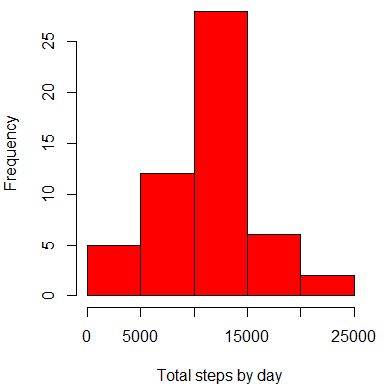
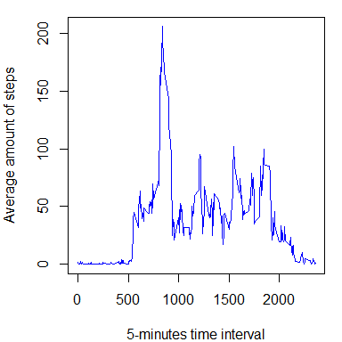
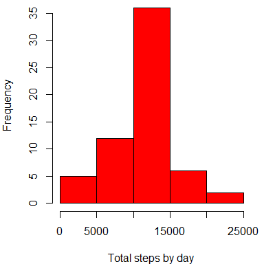
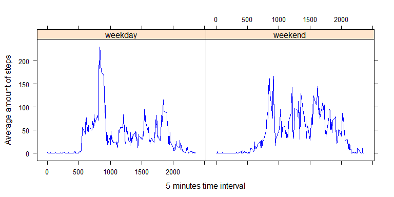

# Reproducible Research: Peer Assessment 1
Benjamín Sánchez  


*Last compilation on 2015-10-18 20:37:24*  

***

## 1. About

This report displays the analysis of data from a personal activity monitoring device. The device measured the number of steps taken in 5 minute intervals through out the day, during the months of October and November 2012, from an anonymous individual. In this report we show different analysis of the data, including the daily amount of steps, the average amount of steps by time interval, and differences between weekdays and weekends.

***

## 2. Loading and preprocessing the data

We will start by loading the dataset, converting the date variable to a date object and displaying a small summary.


```r
#Load, preprocess and display summary of data:
dataset      <- read.csv('activity.csv')
dataset$date <- as.Date(dataset$date, format = '%Y-%m-%d')
summary(dataset)
```

```
##      steps             date               interval     
##  Min.   :  0.00   Min.   :2012-10-01   Min.   :   0.0  
##  1st Qu.:  0.00   1st Qu.:2012-10-16   1st Qu.: 588.8  
##  Median :  0.00   Median :2012-10-31   Median :1177.5  
##  Mean   : 37.38   Mean   :2012-10-31   Mean   :1177.5  
##  3rd Qu.: 12.00   3rd Qu.:2012-11-15   3rd Qu.:1766.2  
##  Max.   :806.00   Max.   :2012-11-30   Max.   :2355.0  
##  NA's   :2304
```

As it can be seen, the dataset contains 3 variables: `steps` (numeric; the number of steps taken in each day during each time interval), `date` (date object; displayed as year-month-day) and `interval` (numeric; 5-minutes time interval of the day in the format HHMM, were HH is the hour of the date (0-23) and MM is the first minute of the interval (0-55)).

***

## 3. What is mean total number of steps taken per day?

Now that we have the data loaded, we will start by counting up how many steps were taken each day, and saving that variable in `daily_steps`. A histogram of the total number of steps taken per day is shown in figure 1.


```r
#Add up all steps by day:
daily_steps <- aggregate(steps ~ date, data = dataset, FUN = sum, na.rm = TRUE)

#Plot Histogram:
par(mfrow = c(1,1),mar = c(4, 4, 0, 1))
with(daily_steps,hist(steps, col = 'red', xlab = 'Total steps by day', main = ''))
```

 

**Figure 1:** Histogram with the total number of steps taken by day.
  

Additionally, we will calculate the mean and median of the daily amount of steps.


```r
#Adjust number format when printing (avoid scientific notation and only show 2 decimal places):
options(scipen=999)
options(digits=2)

#Calculate and display mean:
mean_steps <- mean(daily_steps$steps)
mean_steps
```

```
## [1] 10766
```

```r
#Calculate and display median:
median_steps <- median(daily_steps$steps)
median_steps
```

```
## [1] 10765
```

The mean is 10766.19 steps/day and the median is 10765 steps/day.

***

## 4. What is the average daily activity pattern?

Next we will count how many steps on average were taken during each time interval of 5 minutes, and save that variable as `interval_steps`. A time series plot of the average number of steps taken per time interval is shown in figure 2.


```r
#Average steps by time interval:
interval_steps <- aggregate(steps ~ interval, data = dataset, FUN = mean, na.rm = TRUE)

#Plot time series plot:
par(mfrow = c(1,1),mar = c(4, 4, 1, 1))
with(interval_steps,plot(interval,steps, type = 'l', col = 'blue', xlab = '5-minutes time interval', 
                         ylab = 'Average amount of steps', main = ''))
```

 

**Figure 2:** Time series plot with the average number of steps taken by time interval of 5 minutes.
  

From figure 2 we can observe the maximum amount of steps on average done during the day are 206.17 steps. In the following let's find out when in the day is that maximum achieved.


```r
#Find interval with maximum average amount of steps:
max_pos      <- which.max(interval_steps$steps)
max_interval <- interval_steps$interval[max_pos]
max_interval
```

```
## [1] 835
```

As it can be seen, the maximum amount of steps during the day is achieved in the interval 835, which means between 8:35 and 8:40.

***

## 5. Imputing missing values

Several values of the amount of steps are not available and therefore are reported as `NA`. Let's see how much values are like that.


```r
#Count the amount of NA values present in the dataset:
na_amount <- sum(is.na(dataset$steps))
na_amount
```

```
## [1] 2304
```

There are therefore a total of 2304 of `NA` values. In the following we will create `new_dataset`, which will be the same as `dataset` but will have each of the `NA` values replaced with the mean for the corresponding 5-minute interval (calculated in part 4).


```r
#Create new dataset, with replaced NA values:
new_dataset <- dataset
for(i in 1:length(dataset$steps)) {
    if(is.na(dataset$steps[i])) {
        new_dataset$steps[i] <- interval_steps$steps[interval_steps$interval == dataset$interval[i]]
    }
}
summary(new_dataset)
```

```
##      steps          date               interval   
##  Min.   :  0   Min.   :2012-10-01   Min.   :   0  
##  1st Qu.:  0   1st Qu.:2012-10-16   1st Qu.: 589  
##  Median :  0   Median :2012-10-31   Median :1178  
##  Mean   : 37   Mean   :2012-10-31   Mean   :1178  
##  3rd Qu.: 27   3rd Qu.:2012-11-15   3rd Qu.:1766  
##  Max.   :806   Max.   :2012-11-30   Max.   :2355
```

As the summary shows, there are no `NA` values in `new_dataset`. Now that we have an improved dataset, we can, for instance, repeat the analysis done in part 3. The variable `new_daily_steps` counts how many steps were taken each day in the new dataset. Figure 3 displays a histogram of this.


```r
#Add up all steps by day in new dataset:
new_daily_steps <- aggregate(steps ~ date, data = new_dataset, FUN = sum)

#Plot Histogram:
par(mfrow = c(1,1),mar = c(4, 4, 0, 1))
with(new_daily_steps,hist(steps, col = 'red', xlab = 'Total steps by day', main = ''))
```

 

**Figure 3:** Histogram with the total number of steps taken by day - dataset with no `NA` values.
  

Is interesting to notice (if one checks the full original dataset) that all of the `NA` values are for 9 complete days, so by replacing them with the interval averages we are creating 9 identical days in terms of amount of steps. This is reflected in figure 3, given that the only diference between this histogram and the histogram of figure 1 is the increase of the third bar in 9 days of frequency. We can also calculate the mean and median of this new dataset.


```r
#Calculate and display mean:
new_mean_steps <- mean(new_daily_steps$steps)
new_mean_steps
```

```
## [1] 10766
```

```r
#Calculate and display median:
new_median_steps <- median(new_daily_steps$steps)
new_median_steps
```

```
## [1] 10766
```

The new mean is 10766.19 steps/day and the new median is 10766.19 steps/day. As expected, the mean did not change, because the values were taken from time interval averages and for complete days, therefore for each of those days (9 in total) the sum of steps was exactly 10766.19 steps. On the other hand, the median did slightly increase (and actually matched the mean) given the increase of the amount of days with 10766.19 steps.

***

## 6. Are there differences in activity patterns between weekdays and weekends?

Finally, we will see differences between weekdays and weekends. For that we will start by including `day_type`, a factor variable for each measurement that indicates if the date is a weekday or a weekend.


```r
#Create boolean variable is_weekend =1 if it is a weekend or =0 if not:
is_saturday <- weekdays(new_dataset$date) == 'Saturday'
is_sunday   <- weekdays(new_dataset$date) == 'Sunday'
is_weekend  <- is_saturday + is_sunday

#Append is_weekend as a factor variable to the current dataset:
new_dataset$day_type <- factor(is_weekend, labels = c('weekday','weekend'))
```

Using this variable we can, for instance, compare how many steps on average were taken during each time interval of 5 minutes, both on the weekdays and the weekends. A time series plot of this is shown in figure 4.


```r
#Average steps by time interval:
new_interval_steps <- aggregate(steps ~ interval + day_type, data = new_dataset, FUN = mean)

#Plot time series plot using the lattice package:
library(lattice)
xyplot(steps ~ interval | day_type, data = new_interval_steps, layout = c(2, 1), type = 'l', col = 'blue',
       xlab = '5-minutes time interval', ylab = 'Average amount of steps')
```

 

**Figure 4:** Time series plot with the average number of steps taken by time interval - weekday Vs. weekend.
  

From figure 4 we can observe that during weekends the step activity is spread out during a larger portion of the day, whereas during weekdays most of the activity is concentrated in the morning.

***
